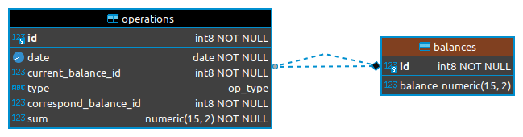

# Balace finalwork

## Реализация (этап 1)

Проект реализован с использованием **Spring Boot**.

### 1. Взаимодействие с базой
Собственно база

[Ссылка на dump базы](./dump-ib-202110182144.tar)



Параметры подключения к базе задаются в файле application.properties

_spring.datasource.url=jdbc:postgresql://localhost:5432/ib <br>
spring.datasource.driver-class-name=org.postgresql.Driver <br>
spring.datasource.username=postgres <br>
spring.datasource.password=1q2w3e4r <br>_

За работу с базой данных отвечают классы:
- **Balance** - является представлением записи таблицы _balances_ базы _ib_.
```java
@Entity
@Table(name="balances")
public class Balance {
    @NotNull
    @Id
    private Long id;
    @PositiveOrZero
    @Digits(integer = 12, fraction = 2)
    private BigDecimal balance;
    ...
}
```
- **Operation** - является представлением записи таблицы _operations_ базы
```java
@Entity
@Table(name = "operations")
public class Operation {

    public enum Type{debit, credit}

    @NotNull
    @Id
    @GeneratedValue(strategy= GenerationType.SEQUENCE, generator = "operation_sequence")
    @SequenceGenerator(name="operation_sequence", sequenceName="operation_sequence", allocationSize = 1)
    private Long id;
    @NotNull
    private Date date;
    @Column(name = "current_balance_id")
    @NotNull
    private Long currentBalanceId;
    @Column(name = "type")
    @NotNull
    @Enumerated(EnumType.STRING)
    private Type type;
    @Column(name = "correspond_balance_id")
    @NotNull
    private Long correspondBalanceId;
    @Positive
    @Digits(integer = 15, fraction = 2)
    private BigDecimal sum;
    ...
```
- **BalanceRepository** - интерфейс, отнаследованный от JpaRepository, для верхнеуровневого интерфейса с базой(таблица балансов).
```java
public interface BalanceRepository extends JpaRepository<Balance,Long> {}
```
- **OperationRepository** - интерфейс, отнасленованный от JpaReposytory для верхнеуровнего интерфиейса с базой(таблица операций)
```java
public interface OperationRepository extends JpaRepository<Operation,Long> {
    List<Operation> findOperationsByCurrentBalanceId(Long id);

    List<Operation> findOperationsByCurrentBalanceIdAndDateAfter(Long id, Date date);

    List<Operation> findOperationsByCurrentBalanceIdAndDateBetween(Long id, Date dateStart, Date dateStop);

    List<Operation> findOperationsByCurrentBalanceIdAndDateBefore(Long id, Date date);
}
```
- **BalanceService** - основной класс, реализующий логику взаимодействия с базой, в котором,
собственно, и реализованы методы _getBalance_, _takeMoney_, _putMoney_, _transferMoney_, _getOperationList_. Взаимодействие с базой производится с помощью методов
 _BalanceRepository_ отнаследованных от JpaRepository. Методы _takeMoney_, _putMoney_, _transferMoney_ аннотированы @Transactional для внесения записей в таблицы **_balances_** и **_operations_** одной транзакцией.

```java
import org.springframework.stereotype.Service;

@Service
public class BalanceService {

    private final BalanceRepository balanceRepository;
    private final OperationRepository operationRepository;

    public BalanceService(BalanceRepository balanceRepository, OperationRepository operationRepository) {
        this.balanceRepository = balanceRepository;
        this.operationRepository = operationRepository;
    }
    ...
```

### 2. Реализация API

Контроллером обработки данных API запросов является класс **BalanceController**, в 
который внедрена зависимость **BalanceService**
```java
@RestController
@Validated
@RequestMapping(path = "api")
public class BalanceController {
    private final BalanceService balanceService;

    public BalanceController(BalanceService balanceService) {
        this.balanceService = balanceService;
    }
    ...
```
_@Validated_ "намекает" на то, что параметры запросов валидируются.

Для стандартизации ответов на запросы реализован класс **BalanceResponse**
с одним статическим методом формирования объекта класса **ResponceEntity**, инициализируя его HashMap<String,Object>. 

В результате клиент получает ответ в виде json:
```json
{
    "status": 0 (ошибка выполнения запроса) || 1 (успешно выполненный запрос),
    "message": текст ошибки || "success",
    "data": null || запрашиваемый объект 
}
```

При обработке запросов выполняется валидация параметров запросов, и в случае ошибок выдается стандартизированный **ResponceEntity**.
```java
@ExceptionHandler(ConstraintViolationException.class)
@ResponseStatus(HttpStatus.BAD_REQUEST)
ResponseEntity<Object> handleConstraintViolationException(ConstraintViolationException e) {
    return BalanceResponse.makeResponse(0,"Parameter validation error: " + e.getMessage(),
            null, HttpStatus.BAD_REQUEST);
}

@ExceptionHandler(IllegalArgumentException.class)
@ResponseStatus(HttpStatus.BAD_REQUEST)
ResponseEntity<Object> handleIllegalArgumentException(IllegalArgumentException e) {
    return BalanceResponse.makeResponse(0,"Illegal parameter error: " + e.getMessage(),
            null, HttpStatus.BAD_REQUEST);
}
```

Все API методы выполнены в виде GET запросов с параметрами:
1. http://_servername_:8080/api/getBalance?id=_id_

   Ответы в случае успеха и ошибки соответсвенно:
```json
{
    "status": 1,
    "message": "success", 
    "data": текущий баланс
}
```
```json
{
    "status": 0,
    "message": "Текст ошибки",
    "data": null
}
```

2. http://_servername_:8080/api/takeMoney?id=_id_&sum=_sum_

   Ответы в случае успеха и ошибки соответсвенно:
```json
{
    "status": 1,
    "message": "success", 
    "data": null
}
```
```json
{
  "status": 0,
  "message": "Текст ошибки",
  "data": null
}
```

3. http://_servername_:8080/api/putMoney?id=_id_&sum=_sum_
   Ответы аналогичны для метода _takeMoney_
4. http://_servername_:8080/api/getOperationList?id=_id_&dateAfter=_dd-mm-yyyy_&dateBefore=_dd-mm-yyyy_

id - обязательный параметр, dateAfter и dateBefore - нет

в случае успешного выполнения возвращается
```json
{
    "status": 1,
    "message": "success", 
    "data": список операций(List<Map<String,Object>>)
}
```
при отсуствии операций:
```json
{
"status": 0,
"message": "operations not found",
"data": null
}
```
5. http://_servername_:8080/api/transferMoney?senderId=_senderId_&receiverId=_receiverId_&sum=_sum_
 
в случае успешного выполнения возвращается
```json
{
    "status": 1,
    "message": "success", 
    "data": null
}
```
в случае ошибок

```json
{
    "status": 0,
    "message": "текст ошибки", 
    "data": null
}
```